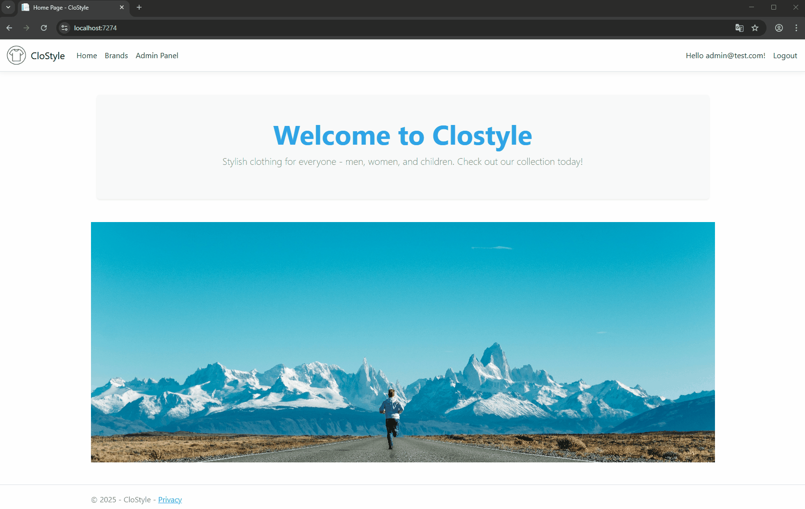
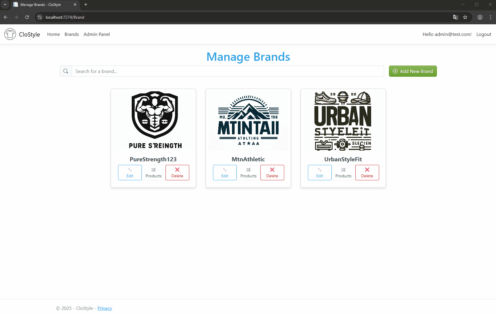
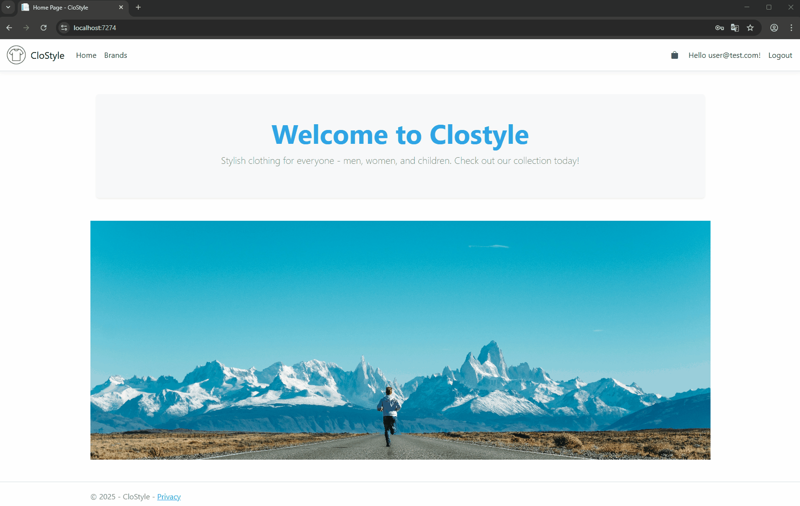

# CloStyle 👕🧥

This is a project I am currently working on in my free time.

**CloStyle** is a web application built with **ASP.NET Core MVC**, designed to manage clothing brands and their associated products.

---

## 🛠 Technologies and Tools

### Backend
- ASP.NET Core MVC (C#)
- Entity Framework
- SQL Server
- ASP.NET Core Identity

### Architecture
- CQRS with MediatR
- Repository Pattern
- Dependency Injection
- Clean Architecture

### Frontend
- Razor Pages
- Bootstrap 5
- JavaScript

### Utilities
- AutoMapper
- Fluent Validation

## 🎥 Application Demo

### General Application Overview

*A quick tour through the main application features.*

### Admin Panel Overview

*Preview of the main admin dashboard - admins are able to manage user roles as well as their brands and products*

### Create New Brand

*Demonstration of adding a new brand and product to the system - admins can add as much brands as they want*

### Edit & Delete Functionality

*Editing and removing existing brands - admins can edit/delete every brand that was created*

### Edit Brand (Owner)

*Brand owner updating brand details - brand owners can only edit their own brands and products that are related to it*

### Brand Limit & Owner Panel

*Each owner can have up to 5 brands at a time. The owner panel displays key information such as revenue and other important metrics.*

### Adding Items to cart

*Users are able to browse brands and related products, and also add products to cart*

## 📌 Features
- Brand and product management (CRUD operations)
- User authentication and authorization using ASP.NET Core Identity
- Role-based access control
- Responsive UI using Bootstrap
- Admin Panel used to manage accounts - browsing brands, changing roles, deleting users

